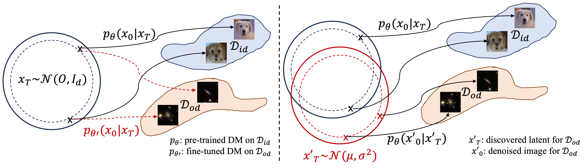

# Discovery and Expansion of New Domains within Diffusion Models

This is the official Pytorch implementation for the paper **Discovery and Expansion of New Domains within Diffusion Models**.

Ye Zhu, Yu Wu, Duo Xu, Zhiwei Deng, Yan Yan, Olga Russakovsky

[Paper](https://arxiv.org/abs/2310.09213)


### Updates:

- (06/2024) While the code should be mostly ready to use, I may continue fixing some minor bugs.


<p align="center">
    


## 1. Project Overview and Take Away

In this work, we seek to explore the domain generalization ability within diffusion generative models under the few-shot scenario and introduce a novel paradigm, which we refer to as *latent discovery based* method to achieve domain expansion. Unlike tuning-based methods that seek to change the generative mapping trajectories, we propose to find extra qualified latent encodings given the prior information from a small set of target OOD data samples.

The design philosophy of this tuning-free paradigm has been adopted in several of my previous projects for versatile DM-based applications in [BoundaryDiffusion, NeurIPS 2023](https://arxiv.org/abs/2302.08357) and [COW, ICLR 2024](https://arxiv.org/abs/2306.08247). However, the previous two projects still mainly focus on working within the In-Domain of pre-trained diffusion models, in this work, we seek to step out of the original training space of DMs.


## 2. Setup


### 2.1 Environment

The environment setup follow my previous diffusion based projects, an example for setting up the experimental environment can be found below.

```
conda create --name diff python=3.9
conda activate diff
# install the pytorch and cudatoolkit based on your own machine.
conda install pytorch torchvision torchaudio pytorch-cuda=12.1 -c pytorch -c nvidia
git clone https://github.com/L-YeZhu/DiscoveryDiff.git
cd DiscoveryDiff
pip install -r requirements.txt
```


### 2.2 Datasets

The dataset paths can be modified in ```./configs/paths_configs.py``` file.

- Natural images: 

I have tested some natural image domains including those from AFHQ-Dog, CelebA-HQ, and LSUN as demonstrations. These datasets are commonly used image datasets in computer vision, and all of them are open-access. Feel free to download and play with them from their corresponding sources.


- Astrophysical images: 

In addition to the natural images, I have tested several astrophysical datasets as unseen target domains in this project, which includes [Galaxy Zoo](https://data.galaxyzoo.org) and the radiation field of the molecular clouds (from [this paper](https://iopscience.iop.org/article/10.3847/1538-4357/acfedc)). Those datasets feature larger domain gaps with respect to the training domains given a pre-trained DDPM, also yeild better performance under our proposed method.

For the tested astrophysical datasets, Galaxy Zoo is an open-access dataset that contains real images of galaxies and annotations. The radiation field data has been used in Dr Duo Xu's previously published paper *Predicting the Radiation Field of Molecular Clouds Using Denoising Diffusion Probabilistic Models* in the Astrophysical Journal. In case you are interested in doing further research with the astrophysical dataset, we recommend you contact me or/and Dr. Duo Xu for more details.

Note that the original data of the radiation field **are not images but physical quantities**, we process and visualize them as images in this project for illustration purposes for researchers outside the astrophysical field.  


### 2.3 Base diffusion models

I used several different pre-trained diffusion generative models as base models for experiments as demonstrations, different base models along with their training datasets may yield diverse effects. The paths to the pre-trained models can be modified also in ```./configs/paths_configs.py``` file. 


#### Generic and unconditional DMs 
You can find those model checkpoints from existing open sources depending on the resolution and DDPM variants you want to experiment with. The choices of the base model should stay consistent with your experimental datasets in terms of resolutions.
For easy usage, I include the links to my own model collections below (I didn't train those base models, credits to previous researchers): [iDDPM trained on AFHQ-Dog in 256 resolutions](https://drive.google.com/file/d/1QVzY-G5qV-e1WWLEMaUsRscbVgtaYPnv/view?usp=share_link), [DDPM trained on CelebA in 256 resolutions](https://drive.google.com/file/d/1nvZBEPlXBKle2ib-X6Bsfyxt1l__4CNj/view?usp=share_link), [DDPM trained on LSUN-church in 256 resolutions](https://drive.google.com/file/d/1LHFon1Mjl1uBG91LHvTL1hsFvxYdGoU2/view?usp=share_link), [DDPM trained on LSUN-Bedroom in 256 resolutions](https://drive.google.com/file/d/1C2BREKRaaGr6VlpNqLbaQwjHeLuDcYsR/view?usp=share_link).


#### Large T2I models

I also tested two large T2I models i.e., StableDiffusion_v2.1 and GPT4, with the following same text prompts for the astro tasks above. We observe that the existing T2I models are not (yet) appropriate for generating such specific astrophysical data given they are trained to optimize the modeling of overall distributions.

```
1. Generate a realistic image of galaxy.
2. Generate a realistic image about the radiation field of molecular clouds in astronomy.
```


## 3. Analytical Experiments on Representation Ability

Our work is based on the key observation: a DM trained even on a single domain small dataset already has sufficient representation ability to accurately reconstruct arbitrary unseen images from the inverted latent encoding following a relatively deterministic denoising trajectory.
And then followed by the question of how we can leverage its powerful representation ability to achieve novel, creative, and useful applications.


### 3.1 Unseen reconstruction

Given a pre-trained diffusion domain on a single domain dataset (e.g., dog faces on AFHQ-Dog-256), we aim to show that the pre-trained model can reconstruct an arbitraty image with deterministic inversion and denoising processes [1].

To test this, you can use the following:

```
python main.py --config {DATASET}.yml --unseen_reconstruct --img_path {}
```


### 3.2 Inverted unseen priors

For the inversion part, I used my implementations from [BoundaryDiffusion](https://github.com/L-YeZhu/BoundaryDiffusion) based on DDIM paper [1].


```
python main.py --config {DATASET}.yml --inversion --
```


### 3.3 Domain interference


## 4. Latent sampling techniques

This is the key technical challenge for this project, due to the mode interference issue that we have described in the paper.
It is possible to perform latent sampling with various techniques.


## 5. Evaluations and Applications

The evaluation should in general follow the corresponding protocols of the end tasks. 
In other words, if your objective is to generate new natural images, then it is possible to evaluate the results based on some commonly used scores such as FID. However, if your end task is more specific, you may want to follow whatever evaluations the end application areas are doing.


## 6. Citation

If you find this work useful and interesting, please consider citing the paper.

```
@article{zhu2024discovery,
  title = {Discovery and Expansion of New Domains within Diffusion Models},
  author = {Zhu, Ye and Wu, Yu and Xu, Duo and Deng, Zhiwei and Russakovsky, Olga and Yan, Yan},
  journal = {arXiv preprint arXiv:2310.09213},
  year = {2024},
}
``` 


### References

[1]  Song, Jiaming, Chenlin Meng, and Stefano Ermon. “Denoising diffusion implicit models.” In ICLR 2021.

